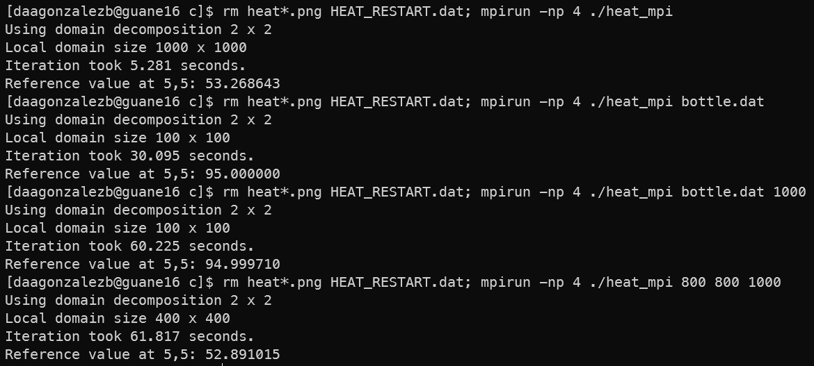

# Código de la ecuación de calor en 2D usando MPI

El siguiente repositorio contiene el código de la ecuación de calor en 2D usando MPI.

### Estructura del repositorio

En este repositorio, se encuentran varios archivos que desempeñan un papel fundamental en la implementación de la ecuación de calor en 2D. Cada archivo cumple una función específica y se encarga de una parte diferente de la simulación. A continuación, se describe el propósito de cada uno de estos archivos:

- **_core.c_**: Contiene las funciones que se encargan de la simulación de la ecuación de calor en 2D. En este archivo se definen las funciones que se utilizan para realizar las iteraciones de la simulación y se incluyen las funciones que se encargan de la comunicación entre los procesos.

- **_heat.h_**: En este archivo se definen las estructuras de datos que se utilizan para almacenar los campos de temperatura y las funciones que se utilizan para trabajar con estas estructuras.

- **_io.c_**: Contiene las funciones encargadas de la entrada y salida de datos.

- **_main.c_**: Este archivo es el punto de entrada principal del programa. Aquí se encuentra la función "main," que inicia la simulación de la ecuación de calor en 2D utilizando MPI (Message Passing Interface) para la programación paralela. Se encarga de la inicialización, la ejecución de las iteraciones y la finalización de la simulación.

- **_pngwriter.c y pngwriter.h_**: Proporcionan funciones que permiten almacenar los resultados en formato PNG.

- **_setup.c_**: Contiene funciones relacionadas con la configuración inicial de la simulación de la ecuación de calor. Estas funciones leen los argumentos de la línea de comandos, inicializan el campo de temperatura y configuran la paralelización de la simulación.

- **_utilities.c_**: Este archivo ofrece funciones de utilidad para el manejo de matrices y espacios de memoria.

### Instrucciones de compilación

### 1. Carga del módulo mpi

`bash $ module load devtools/mpi/openmpi/3.1.4`

### 2. Compilación del código

para este caso lo más sencillo es llamar al archivo Makefile que se encuentra en la carpeta del código fuente, para esto se debe ejecutar el siguiente comando:

`bash $ make clean`
`bash $ make`

Como nota adicional, se recomienda eliminar el archivo HEAT_RESTART.dat antes de ejecutar el programa.
Este archivo funciona como checkpoint y si existe, el programa lo lee y continua la simulación desde ese punto.

### Instrucciones de ejecución

Para ejecutar el programa tenemos varias opciones dependiendo de lo que necesitemos:

- **_Predeterminado_**: Para ejecutar el programa con los parámetros por defecto, se debe ejecutar el siguiente comando:
  `bash $ mpirun -np X ./heat_mpi`
  donde X es el número de procesadores que se desean utilizar.

- **_Tomando el campo de temperatura inicial de un archivo_**: Para ejecutar el programa con un campo de temperatura inicial diferente al predeterminado, se debe ejecutar el siguiente comando:
  `bash $ mpirun -np X ./heat_mpi <archivo>`
  donde X es el número de procesadores que se desean utilizar y <archivo> es el nombre del archivo .dat que contiene el campo de temperatura inicial.

- **_Especificando el paso de tiempo_**: Para ejecutar el programa con un paso de tiempo diferente al predeterminado, se debe ejecutar el siguiente comando:
  `bash $ mpirun -np X ./heat_mpi <archivo> <paso de tiempo>`
  donde X es el número de procesadores que se desean utilizar, <archivo> es el nombre del archivo .dat que contiene el campo de temperatura inicial y <paso de tiempo> es el paso de tiempo que se desea utilizar.

- **_Especificando las dimensiones del campo y el paso de tiempo_**: Para ejecutar el programa con un campo de temperatura inicial diferente al predeterminado, se debe ejecutar el siguiente comando:
  `bash $ mpirun -np X ./heat_mpi <filas> <columnas> <paso de tiempo>`
  donde X es el número de procesadores que se desean utilizar, <filas> es el número de filas del campo de temperatura inicial, <columnas> es el número de columnas del campo de temperatura inicial y <paso de tiempo> es el paso de tiempo que se desea utilizar.

### Compilación y ejecución del programa en modo pasivo

Para compilar y ejecutar el programa en modo pasivo se debe crear un archivo .sh como el siguiente:

```
#!/bin/bash
#SBATCH -o output.log
#SBATCH -J heat_distribution
#SBATCH --nodes=1
#SBATCH --ntasks-per-node=4

module load devtools/mpi/openmpi/3.1.4

make clean
make

mpirun -np 4 ./heat_mpi bottle.dat 1000
```

Después de crear el archivo, se debe ejecutar el siguiente comando:

`bash $ sbatch <archivo>.sh`

### Pruebas sin mejoras de código



### Pruebas con mejoras de código


### Conclusiones

- El uso de MPI para la programación paralela es una herramienta muy útil para la simulación de sistemas físicos, ya que permite reducir el tiempo de ejecución de los programas y, por lo tanto, permite realizar simulaciones más complejas en menos tiempo.

- Al tratar de optimizar los ciclos for con MPI en la aplicación me encontre con resultados incompletos o errados en la simulación, por lo que decidí no incluirlos en el código final.
