# Actividad CUDA

CUDA son las siglas de Compute Unified Device Architecture (Arquitectura Unificada de Dispositivos de Cómputo) que hace referencia a una plataforma de computación en paralelo que incluye un compilador y un conjunto de herramientas de desarrollo creadas por Nvidia que permiten a los programadores usar una variación del lenguaje de programación C (CUDA C) para codificar algoritmos en GPU de Nvidia.

## Ejecución de CUDA dentro del súiper computador GUANE

Estando parados sobre GUANE debemos de solicitar recursos con el comando:

```
srun -n 8 --pty /bin/bash
```

En este caso estaremos usando una maquina que tiene 8 nodos con la máxima cantidad de GPUs disponibles, pero en dado caso que vayamos a requerir un numero específico de GPUs usamos el siguiente comando:

```
srun -n 8 --gres=gpu:2 --pty /bin/bash
```

Donde en este caso estamos solicitando el uso de 2 GPUs.

En caso de querer acceder a otro tipo de maquina como lo es Yaje, usamos el siguiente comando:

```
srun -p Viz -n 2 --pty /bin/bash
```

Estando posicionado sobre alguna de las particiones o maquinas, debemos de cargar los módulos que nos permitirán ejecutar nuestros códigos en CUDA:

```
module load devtools/cuda/8.0
```

Una vez hecho esto ya solo queda compilar y ejecutar nuestros códigos

```
<!-- Para compilar -->
nvcc XXX.cu -o Exec
<!-- Para ejecutar-->
./Exec
```

## Información del primer código (multiGPU.cu)

Esencialmente, este programa utiliza CUDA para aprovechar la capacidad de procesamiento en paralelo de una GPU y realizar la suma de dos arreglos de manera eficiente.
En este se definen constantes como NB (número de bloques), NT (número de hilos por bloque) y N (tamaño total del arreglo). Los cuales juegan un papel importante a la hora de hacer pruebas bajo diversas condiciones de recursos asignados

## Información del segundo código (multidevice.cu)

Este código es un programa en C que utiliza CUDA y multihilo para calcular el producto punto de dos vectores en paralelo utilizando múltiples dispositivos GPU.
Esto lo realiza utilizando dos dispositivos GPU. Se utiliza la biblioteca book.h para gestionar errores de CUDA y proporciona funciones para trabajar con hilos.

## Mejoras hechas a multiGPU.cu

Dentro de este código existe un ciclo for, el cual no realiza ninguna funcionalidad y retrasa el tiempo de ejecución, al comentar o eliminar esta linea de código donde se asigna este bloque de iteración se es apreciable la mejora en el tiempo de ejecución, sin que el resultado de la suma se vea afectado.

También hay una solución propuesta donde se hace uso de la memoria unificada, y la versión de la librería CUDA que permite esto, obteniendo resultado similares a la primera mejora.

## Mejoras hechas a multidevice.cu

La mejora en el código del multidevice.cu se basa en poder agregar de forma dinámica la cantidad de GPU's que van a ejecutar el calculo y dividir los datos que llegan a estas GPU's de forma uniforme.
Esto es posible haciendo una reestructuración del código sin que afecte la lógica del proceso.

## Resultados multiGPU.cu

Estas fueron las ejecuciones hechas en una maquina con 8 nodos, específicamente guane13.

- Estos resultados se obtienen teniendo en cuenta que se ejecutaron usando NB=32, NT=500 y N=NB\*NT

  - Código original:

  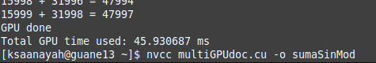

  - Código con la primera mejora:

  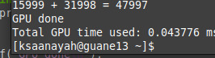

  - Código con la segunda mejora:

  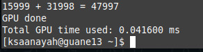

- Estos resultados se obtienen teniendo en cuenta que se ejecutaron usando NB=20, NT=500 y N=NB\*NT

  - Código original:

  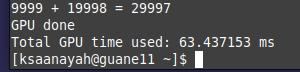

  - Código con la primera mejora:

  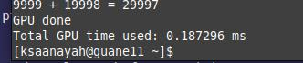

  - Código con la segunda mejora:

  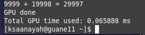

- Estos resultados se obtienen teniendo en cuenta que se ejecutaron usando NB=32, NT=450 y N=NB\*NT

  - Código original:

  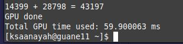

  - Código con la primera mejora:

  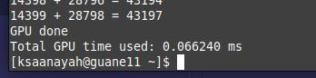

  - Código con la segunda mejora:

  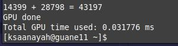

Estas fueron las ejecuciones hechas en una maquina Yaje.

- Código original:

  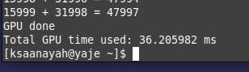

  - Código con la primera mejora:

  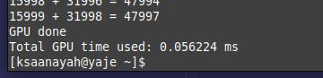

  - Código con la segunda mejora:

  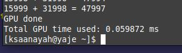

## Resultados multidevice.cu

- En esta primera imagen se muestran los resultados al ejecutar los códigos sobre guane10

  Primeramente se muestra el resultado del código original
  Sus posteriores son las pruebas del código una vez realizados los cambios, haciendo uso de 2, 3, 4, 7 y 8 GPUs respectivamente

  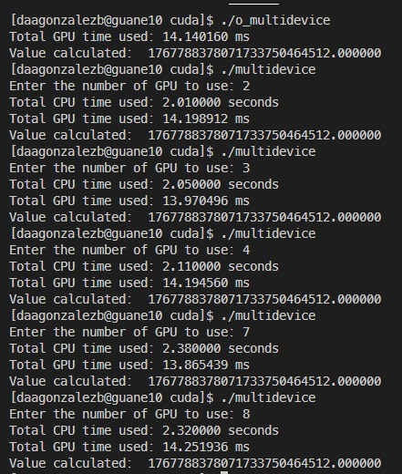

- En la segunda imagen se muestran los resultados al ejecutar los códigos sobre la maquina felix
  donde se ejecuta la prueba del código original y posteriormente el modificado con una asignación de 2 GPU
  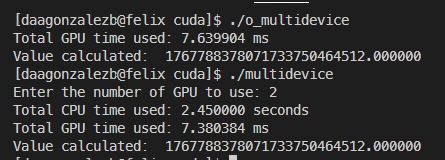
